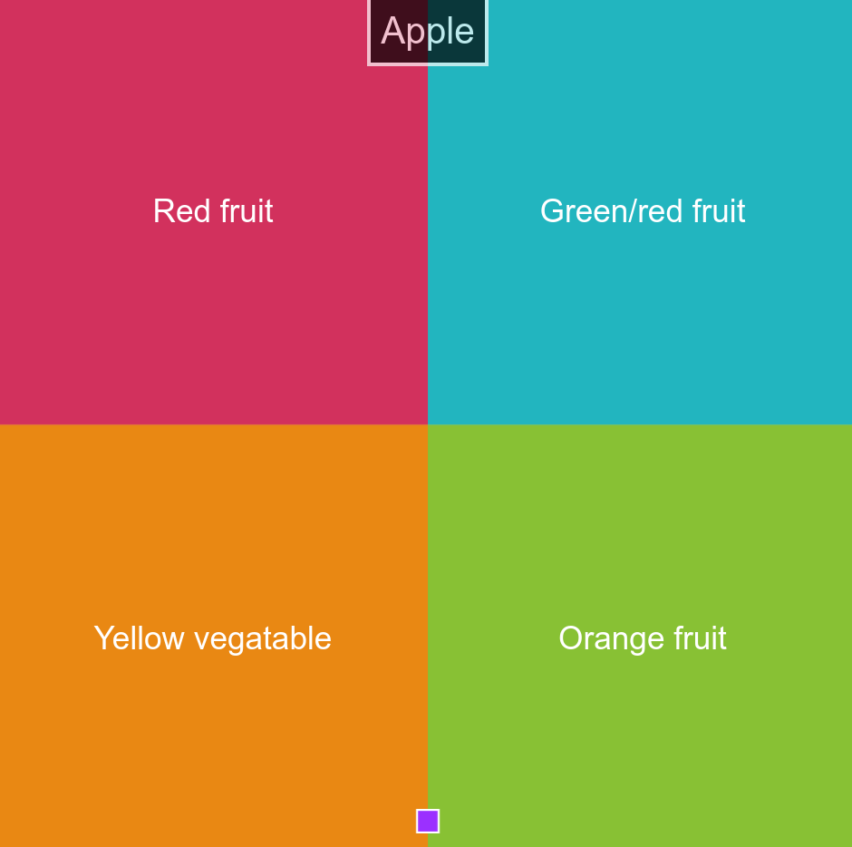
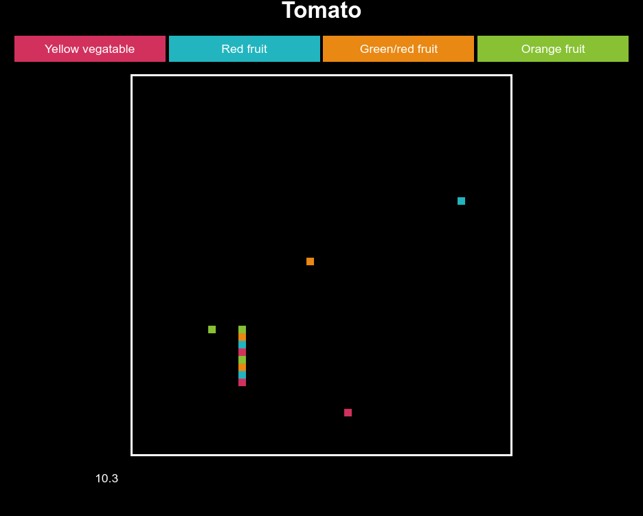
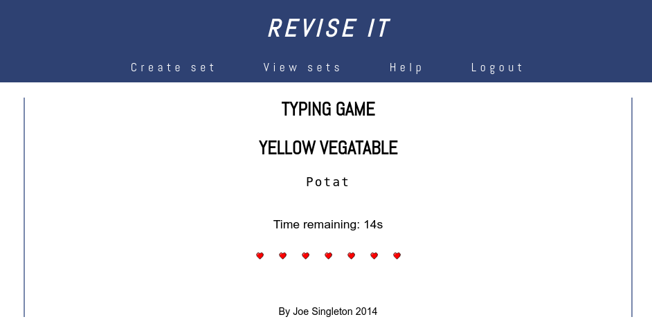
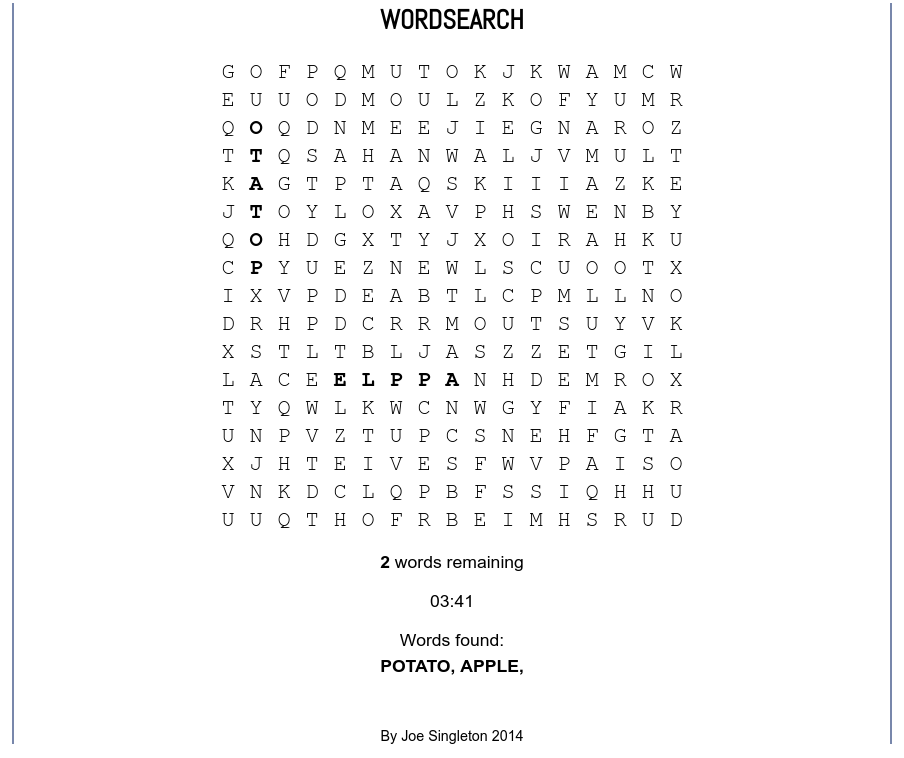

# reviseit
A website to help students revise through quizzes and some simple games

This was made for my A-level computing coursework in 2014/2015

**Update (Dec 2017):**
The site can now be deployed with Docker. To run, install Docker and docker-compose, change the
dummy DB password in `docker-compose.yml`, and from the root of the repo run:

```
docker-compose build
docker-compose up -d
```

This will make the webserver available at `http://localhost:9301`.

The data directory in the MySQL container is mounted as a shared volume from a directory `db` on the
host in the root of the repo (directory will be created if it does not exist).

When running for the first time, create the required tables in the DB:

```
# Get container ID
id=`docker ps -q --filter name=reviseit_db*`

docker exec $id bash -c 'mysql -uroot -p${MYSQL_ROOT_PASSWORD} < /db_setup.sql'
```

Note: I have seen some permission related errors in the MySQL container when the `db` directory is
on an NTFS drive, so create `db` as a symlink to somewhere else if necessary...

## Screenshots






